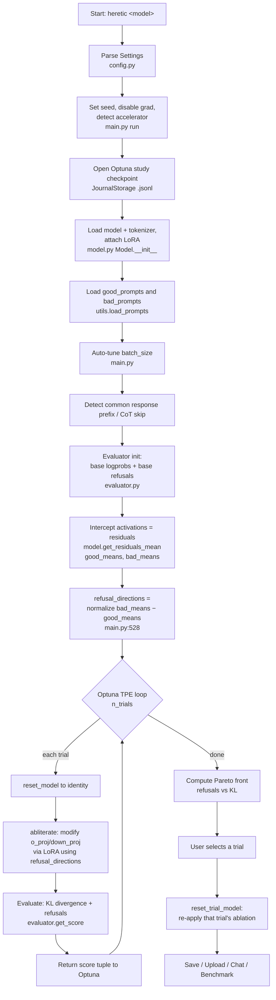
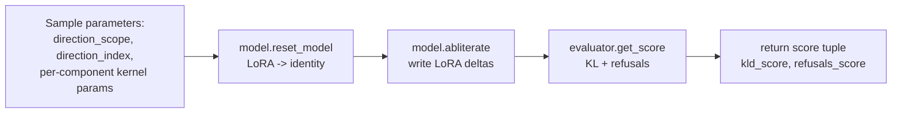
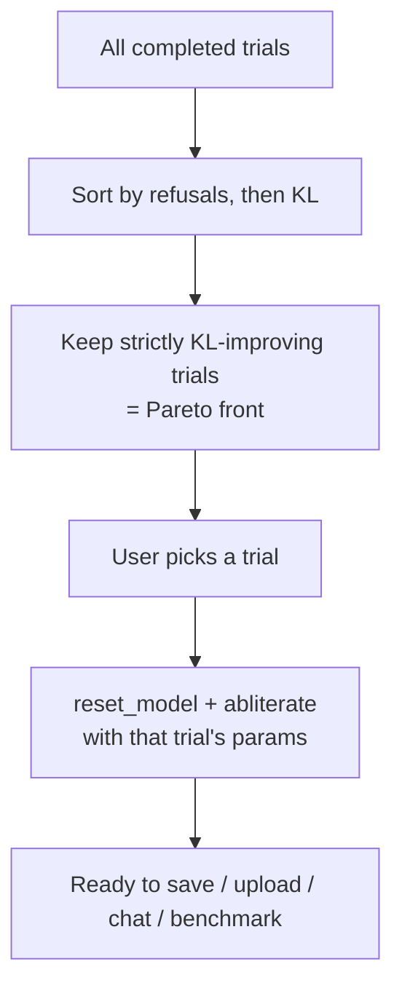

# Heretic — Architecture & End-to-End Pipeline

> 🌐 **Language:** English (this file) · [🇷🇺 Русская версия](ARCHITECTURE_RU.md)

> A complete, exhaustive walkthrough of how Heretic works: from launching the
> program to producing (and saving) a decensored model. This document is written
> for readers who genuinely want to understand the system, including the exact
> places in the code where activations are intercepted, where the refusal
> direction is computed, how ablation is applied to the weights, how KL divergence
> is measured, and how the optimizer selects the final model.
>
> Code references use the form `file:line` and point at the current source tree
> under `src/heretic/`.

---

## Table of contents

1. [What Heretic does (one paragraph)](#1-what-heretic-does)
2. [The core idea: directional ablation](#2-the-core-idea-directional-ablation)
3. [High-level pipeline diagram](#3-high-level-pipeline-diagram)
4. [Supported model architectures](#4-supported-model-architectures)
5. [Where activations are intercepted and stored](#5-where-activations-are-intercepted-and-stored)
6. [Computing the refusal direction (difference of means)](#6-computing-the-refusal-direction)
7. [The optimization loop (Optuna TPE)](#7-the-optimization-loop)
8. [The ablation math — how weights are modified from activations](#8-the-ablation-math)
9. [Evaluation — KL divergence and refusal counting](#9-evaluation)
10. [Scoring, "rollback", and Pareto selection](#10-scoring-rollback-and-pareto-selection)
11. [Saving the model that passed the threshold](#11-saving-the-model)
12. [Determinism and reproducibility](#12-determinism-and-reproducibility)
13. [Module map](#13-module-map)
14. [Research features (interpretability)](#14-research-features)
15. [Glossary](#15-glossary)

---

## 1. What Heretic does

Heretic removes the "safety alignment" (censorship) of a transformer language
model **without any post-training** (no gradient descent on the model). It does so
by **directional ablation** ("abliteration"): it identifies the direction in the
model's activation space that represents "refusal", and surgically removes the
ability of certain weight matrices to write that direction into the residual
stream. The exact ablation strength per layer and per component is chosen
**automatically** by a Bayesian optimizer (Optuna TPE) that co-minimizes two
objectives: the number of refusals on "harmful" prompts, and the KL divergence
from the original model on "harmless" prompts (a proxy for "how much damage was
done to the model's intelligence").

---

## 2. The core idea: directional ablation

A decoder-only transformer maintains a **residual stream**: a running hidden-state
vector that each layer reads from and writes to. Two sub-modules write into the
residual stream in every layer:

- the **attention output projection** (`o_proj` / `out_proj`), and
- the **MLP down projection** (`down_proj` / `w2`).

```
                 residual stream (hidden state h)
   h ──────────────┬───────────────────────────┬─────────────► h'
                   │                           │
              ┌────▼────┐                 ┌────▼────┐
              │ Attention│                 │   MLP   │
              │  block   │                 │  block  │
              └────┬────┘                 └────┬────┘
                   │ writes via                │ writes via
                   │  o_proj  ── ablated ──►   │ down_proj ── ablated
                   └───────────┬───────────────┘
                        (these two projections are the
                         places Heretic orthogonalizes)
```

**Directional ablation** = take the "refusal direction" vector `v` (a unit vector
in hidden-state space), and orthogonalize the *output* of `o_proj` and `down_proj`
with respect to `v`. After ablation, those matrices can no longer add any component
along `v` to the residual stream — so the model can no longer "express refusal".

The refusal direction is computed empirically as a **difference of means**: the
mean hidden state for "harmful" prompts minus the mean hidden state for "harmless"
prompts. See sections 5–6.

Heretic's specific innovations over classic abliteration:

- The per-layer ablation strength follows a **flexible weight kernel** (not a
  constant), whose shape is optimized.
- The refusal-direction index is a **float** — non-integer values linearly
  interpolate between two adjacent per-layer directions, unlocking directions not
  belonging to any single layer.
- Attention and MLP get **independent** ablation parameters (MLP ablation tends to
  damage the model more, so it is often left mostly untouched).

---

## 3. High-level pipeline diagram



Every arrow corresponds to a concrete step in `main.py:run()` (starts at
`main.py:180`).

---

## 4. Supported model architectures

### 4.1 Which model class is loaded

`get_model_class()` (`model.py:39`) inspects the model's config: if any sub-config
contains a `vision_config`, the model is loaded as
`AutoModelForImageTextToText` (multimodal); otherwise as `AutoModelForCausalLM`
(text-only). Multimodal VL models are treated as causal LMs with an added image
encoder — the LoRA `task_type` is always `CAUSAL_LM` (`model.py:229`).

### 4.2 How the transformer layers are located

`get_layers()` (`model.py:367`) unwraps the PEFT wrapper and then tries:

1. `model.model.language_model.layers` — most multimodal models.
2. `model.model.layers` — text-only models.

### 4.3 Which components are ablated

For each layer, `get_layer_modules()` (`model.py:381`) collects the ablatable
projection modules, grouped into two logical components: **`attn.o_proj`** and
**`mlp.down_proj`**. It probes many architecture-specific attribute paths (each in
a `suppress(Exception)` block, so unknown layouts are simply skipped):

| Logical component | Attribute path probed | Architecture |
| :--- | :--- | :--- |
| `attn.o_proj` | `self_attn.o_proj` | most dense models |
| `attn.o_proj` | `linear_attn.out_proj` | Qwen3.5 MoE hybrid (GatedDeltaNet / linear attention) |
| `attn.o_proj` | `conv.out_proj` | LFM dense operator blocks |
| `attn.o_proj` | `self_attn.out_proj` | LFM transformer blocks |
| `mlp.down_proj` | `mlp.down_proj` | most dense models |
| `mlp.down_proj` | `mlp.experts[*].down_proj` | MoE (e.g. Qwen3) |
| `mlp.down_proj` | `block_sparse_moe.experts[*].w2` | Phi-3.5-MoE |
| `mlp.down_proj` | `feed_forward.w2` | LFM dense |
| `mlp.down_proj` | `feed_forward.experts[*].w2` | LFM MoE |
| `mlp.down_proj` | `shared_mlp.output_linear` | Granite MoE Hybrid (attention layers) |
| `mlp.down_proj` | `moe.experts[*].output_linear` | Granite MoE Hybrid (MoE layers) |

Because hybrid models have **different components on different layers**,
`get_abliterable_components()` (`model.py:451`) scans **all** layers to build the
set of components actually present.

### 4.4 What is and isn't supported

- ✅ Most **dense** models, many **multimodal** models, several **MoE**
  architectures, some **hybrid** models (e.g. Qwen3.5).
- ❌ **Pure state-space models** and certain other research architectures are not
  supported out of the box (there is no `o_proj`/`down_proj`-style write matrix to
  orthogonalize). An `assert total_modules > 0` (`model.py:447`) guards against a
  layer with no ablatable module.

### 4.5 On which layers the direction acts

- The **refusal direction** is computed for **every** layer (difference of means
  per layer — section 6).
- For the "global" direction scope, the optimizer samples a `direction_index`
  between `0.4 * last_layer` and `0.9 * last_layer` (`main.py:574`), because
  discrimination between harmful/harmless is strongest **slightly past the midpoint**
  of the layer stack (per Arditi et al. 2024).
- The **ablation weight kernel** (section 8) is centered at `max_weight_position`,
  sampled between `0.6 * last_layer` and `1.0 * last_layer` (`main.py:606`).

---

## 5. Where activations are intercepted and stored

This is the heart of the "interception" question.

### 5.1 The interception site

All activation capture happens in **`Model.get_residuals()` (`model.py:697`)**.
There is **no manual forward hook** — Heretic uses the transformers built-in
`output_hidden_states=True` flag on `model.generate()`:

```python
# model.py:700
_, outputs = self.generate(
    prompts,
    max_new_tokens=1,            # generate exactly ONE token
    output_hidden_states=True,   # <-- ACTIVATION CAPTURE
    return_dict_in_generate=True,
    use_cache=False,
)
hidden_states = outputs.hidden_states[0]   # states for the 1st generated token (model.py:716)
```

`hidden_states` is a tuple over layers; element 0 is the embedding output, elements
1..N are the residual-stream values **after** each transformer block. Heretic keeps
the vector at the **last prompt position** for each layer and stacks them:

```python
# model.py:719
residuals = torch.stack(
    [layer_hidden_states[:, -1, :] for layer_hidden_states in hidden_states],
    dim=1,
)                                          # shape: (prompt, layer+1, hidden_dim)
residuals = residuals.to(torch.float32)    # upcast for numerical stability (model.py:729)
```

So the captured activation is the **residual stream at the last token of the prompt,
for the first generated token**, at every layer boundary. This is exactly the point
where the model "decides" whether to refuse.

```
prompt tokens:      t1  t2  t3 ... tK   [<- generation starts here]
                                   ^
                                   └── residual vector captured at THIS position,
                                       for every layer, for every prompt
```

### 5.2 Optional cleanup applied at capture time

- **Winsorization** (`model.py:731`): if `winsorization_quantile < 1`, each
  per-prompt, per-layer vector is clamped to a symmetric quantile of its absolute
  values — this tames "massive activations" in some models.
- **CPU offload** (`model.py:743`): if `offload_outputs_to_cpu` (default `true`),
  the residual tensor is moved to CPU immediately to reduce peak VRAM.

### 5.3 Where the activations "live" before ablation

Two call paths, in `main.py:499–528`:

- **Default path** (only means needed): `get_residuals_mean()` (`model.py:757`)
  streams batches and accumulates a running sum in **float64 on CPU**, returning
  `good_means` / `bad_means` of shape `(layer+1, hidden_dim)`. The full per-prompt
  residuals are never all held at once.
- **Research path** (`--print-residual-geometry` / `--plot-residuals`):
  `get_residuals_batched()` (`model.py:749`) returns the **full** tensor
  `(prompt, layer+1, hidden_dim)`; then `good_means`/`bad_means` are taken with
  `.mean(dim=0)` and an `Analyzer` inspects the full residuals before they are
  `del`-eted (`main.py:521`).

After the means are computed, the only thing that persists into the optimization
loop is the **`refusal_directions` tensor** (section 6). The bulky per-prompt
residuals and the means are explicitly freed:

```python
# main.py:542
del good_means, bad_means
empty_cache()                # main.py:546
```

`refusal_directions` is held in the `run()` closure and captured by the
`objective()` and `reset_trial_model()` nested functions. It has shape
`(layer+1, hidden_dim)` and lives on CPU (if offloaded) or GPU; during ablation each
row is moved to the relevant module's device on demand (`model.py:531`).

---

## 6. Computing the refusal direction

Once `good_means` (🟢 harmless) and `bad_means` (🔴 harmful) exist, the per-layer
refusal directions are the normalized difference of means (`main.py:528`):

```python
refusal_directions = F.normalize(bad_means - good_means, p=2, dim=1)
#                                 └── harmful minus harmless, per layer, then unit-normalized
```

Optionally (`orthogonalize_direction`, default `true`, `main.py:530`) Heretic
applies **projected abliteration**: it removes from each refusal direction the
component that is parallel to the "good" (harmless) direction, keeping only the
orthogonal part, then re-normalizes. This subtracts *only* the refusal-specific
component and leaves shared semantics intact:

```python
# main.py:534-539
good_directions   = F.normalize(good_means, p=2, dim=1)
projection_vector = torch.sum(refusal_directions * good_directions, dim=1)
refusal_directions = refusal_directions - projection_vector.unsqueeze(1) * good_directions
refusal_directions = F.normalize(refusal_directions, p=2, dim=1)
```

> **Index shift.** `refusal_directions[0]` is the embedding-layer direction. That is
> why, during ablation, layer `i` uses `refusal_directions[i + 1]` and the float
> `direction_index` is shifted by `+1` (section 8, `model.py:472` & `model.py:511`).

---

## 7. The optimization loop

Heretic frames abliteration as **multi-objective black-box optimization** solved by
Optuna's **multivariate TPE** sampler (`main.py:677`):

```python
study = optuna.create_study(
    sampler=TPESampler(
        n_startup_trials=settings.n_startup_trials,  # random exploration first
        n_ei_candidates=128,
        multivariate=True,
        seed=settings.seed,
    ),
    directions=[StudyDirection.MINIMIZE, StudyDirection.MINIMIZE],  # (KL, refusals)
    storage=storage,           # JournalStorage on a .jsonl checkpoint (resumable)
    study_name="heretic",
    load_if_exists=True,
)
```

### 7.1 What one trial does

`objective(trial)` (`main.py:552`):



The sampled parameters per trial:

- `direction_scope` ∈ {`global`, `per layer`} (`main.py:557`). `per layer` sets
  `direction_index = None`, meaning every layer is ablated with its **own**
  direction. `global` uses one interpolated direction for all layers.
- `direction_index`: float in `[0.4·L, 0.9·L]` (`main.py:574`).
- For **each** abliterable component (attn / mlp) a **weight kernel** is sampled
  (`main.py:585–630`):
  - `max_weight` — peak ablation strength. Range `[0.8, 1.5]` for attention, but
    `[-0.25, 1.5]` **clamped to ≥ 0** for MLP, so the optimizer can put positive
    probability mass on **exactly 0** = "don't ablate the MLP at all" (issue #202).
  - `max_weight_position` — layer of peak ablation, in `[0.6·L, 1.0·L]`.
  - `min_weight` — sampled as a fraction of `max_weight` (multivariate TPE can't
    handle variable ranges), then converted to an absolute value.
  - `min_weight_distance` — half-width of the kernel, in `[1, 0.6·L]`.

> **Why all parameters are always sampled**: multivariate TPE does not support
> conditional/variable-range parameters, so `direction_index` is sampled even in
> `per layer` scope and then ignored (`main.py:580`).

### 7.2 Trial-to-trial isolation ("rollback")

There is no literal "rollback of bad weights". Instead, ablation is applied as a
**LoRA adapter** on top of frozen base weights, and between trials the adapter is
reset to the **identity transformation**:

- `reset_model()` (`model.py:315`) — fast path: zero out all `lora_B` matrices
  (`torch.nn.init.zeros_`), which makes the LoRA delta `B·A = 0`, i.e. the model is
  bit-for-bit the original again. No base weights are ever mutated during search.
- Slow path (only when switching models or after a merge): fully reloads the base
  model and re-attaches LoRA.

So each trial starts from a pristine model, applies its own ablation, is scored, and
the next trial simply resets. Nothing needs to be "undone" because the base weights
were never touched. See section 10 for how the *selected* trial is restored.

---

## 8. The ablation math

This section answers: *how are weights determined from activations, and at exactly
which matrices?* All of it is in `Model.abliterate()` (`model.py:461`).

### 8.1 The per-layer ablation weight kernel

For each layer index `i` and component, with parameters
`(max_weight, max_weight_position, min_weight, min_weight_distance)`:

```python
# model.py:489-500
distance = abs(i - max_weight_position)
if distance > min_weight_distance:
    continue                     # too far from the peak -> DON'T ablate this layer
weight = max_weight + (distance / min_weight_distance) * (min_weight - max_weight)
if weight == 0:
    continue                     # 0 strength -> skip (adapter already identity)
```

This is a **tent-shaped kernel** over the layer axis:

```
 strength
  max_weight ┤            ╱╲
             │           ╱  ╲
             │          ╱    ╲
  min_weight ┤    ─────╱      ╲─────
           0 ┤────────┴────────┴────────► layer index
                  ↑    ↑    ↑    ↑
        (no ablation)  │  max_weight_position
                       └── min_weight_distance (half-width);
                           beyond it, layers are untouched
```

Attention and MLP have **independent** kernels, so the two components can be ablated
on different layers with different strengths.

### 8.2 Choosing the direction vector for a layer

```python
# model.py:508-513
if direction_index is None:                 # "per layer" scope
    v = refusal_directions[i + 1]           # this layer's own direction (index shift +1)
else:                                        # "global" scope
    v = interpolated_direction              # computed once (see below)
```

For the global scope, the float `direction_index` interpolates between the two
nearest per-layer directions (`model.py:472`):

```python
weight, index = math.modf(direction_index + 1)     # fractional & integer parts (+1 shift)
v = F.normalize(refusal_directions[int(index)].lerp(refusal_directions[int(index)+1], weight), p=2, dim=0)
```

### 8.3 Turning the direction into a LoRA delta on `o_proj` / `down_proj`

For each target module (an attention `o_proj` or MLP `down_proj`), Heretic computes
a rank-controlled LoRA update that **orthogonalizes the module output** with respect
to `v`. The mathematical identity is:

```
ΔW = −λ · v · (vᵀ W)          (rank-1 outer product)
   ⇒  lora_B = −λ · v          (shape d_out × 1)
      lora_A =  vᵀ W           (shape 1 × d_in)
```

Applying `W + ΔW = (I − λ v vᵀ) W` removes (for `λ = 1`) the component of every
output column along `v`. The base weight `W` is dequantized to float32 first if the
model was loaded in 4-bit (`model.py:541–553`).

**Row normalization** (`row_normalization`, `model.py:558`) has three modes:

| Mode | What happens |
| :--- | :--- |
| `none` | direct rank-1 delta as above (`lora_A = vᵀW`, `lora_B = −λv`). |
| `pre` | compute the delta relative to a **row-normalized** `W`, then rescale `lora_B` by the original row norms so it applies to the original weights. |
| `full` (default) | **norm-preserving biprojected abliteration**: apply the delta, re-normalize rows, restore original row magnitudes, subtract the original to get a delta matrix, then take a **randomized low-rank SVD** (`torch.svd_lowrank`, rank `r = full_normalization_lora_rank`, default 3) and store the truncated factors into `lora_A`/`lora_B`. This approximately preserves each row's magnitude, reducing collateral damage. |

The resulting factors are written directly into the adapter tensors
(`model.py:609–612`):

```python
module.lora_A["default"].weight.data = lora_A.to(...)
module.lora_B["default"].weight.data = lora_B.to(...)
```

> **Answering "before or after normalization / after attention?"**
> The **direction `v`** is derived from the **post-block residual stream** (the
> hidden state after the attention+MLP have been added back — section 5).
> The **ablation** is applied to the **write projections into the residual stream**:
> the attention **output** projection (`o_proj`, after the attention computation) and
> the MLP **down** projection (`down_proj`, the MLP output). Row normalization,
> when enabled, operates on the **weight matrix rows** during the LoRA computation —
> it is a property of how the delta is built, not of the activations.

### 8.4 Why LoRA instead of editing weights directly

- **Speed**: resetting to identity is just zeroing `lora_B` — no reload
  (`model.py:333`).
- **Non-destructive**: base weights are never mutated during the ~200-trial search.
- **Export flexibility**: the final result can be saved as a small adapter, or
  merged into full weights (section 11).

---

## 9. Evaluation

Every trial is scored by `Evaluator.get_score()` (`evaluator.py:95`). Two quantities
are measured on the **evaluation** prompt sets (`good_evaluation_prompts`,
`bad_evaluation_prompts` — held-out `test` splits).

### 9.1 KL divergence (damage to the original model)

At `Evaluator.__init__` (`evaluator.py:32`) the **original** model's first-token
log-probability distributions on the harmless eval prompts are captured **once** as
`base_logprobs`. For each trial, the abliterated model's log-probs on the same
prompts are compared:

```python
# evaluator.py:98
logprobs = self.model.get_logprobs_batched(self.good_prompts)
kl_divergence = F.kl_div(
    logprobs, self.base_logprobs,
    reduction="batchmean", log_target=True,
).item()
```

`get_logprobs()` (`model.py:783`) generates one token with `output_logits=True` and
takes `log_softmax` of the **raw logits** (not processed generation scores, which
could contain `-inf` and produce NaN KL). Lower KL ⇒ the abliterated model behaves
more like the original ⇒ less capability damage.

### 9.2 Refusal count (how censored the model still is)

`count_refusals()` (`evaluator.py:67`) generates full responses (up to
`max_response_length` tokens) to the harmful eval prompts and calls
`is_refusal()` (`evaluator.py:47`) on each. A response is a refusal if:

- it is empty (classified as refusal to avoid the optimizer preferring empty
  outputs), or
- after lowercasing, stripping emphasis `*`, normalizing apostrophes and
  whitespace, it contains any of the ~30 `refusal_markers` (`config.py:431`), e.g.
  `"sorry"`, `"i cannot"`, `"as an ai"`, `"illegal"`, `"unethical"`.

> This is a **text-level heuristic**, entirely separate from the activation-based
> direction computation. It is only a metric, not part of the direction math.

The baseline `base_refusals` (refusals of the **original** model) is measured once at
init (`evaluator.py:42`) and used to normalize the refusal score.

---

## 10. Scoring, "rollback", and Pareto selection

### 10.1 The score tuple

`get_score()` returns a 2-tuple that Optuna minimizes (`evaluator.py:113–125`):

```python
refusals_score = refusals / base_refusals            # fraction of original refusals remaining
if kl_divergence >= kl_divergence_target:            # default target = 0.01
    kld_score = kl_divergence / kl_divergence_scale
else:
    # Below target, replace raw KL with a refusal-driven term so the sampler
    # doesn't waste trials exploring "do-nothing" parameter regions.
    kld_score = refusals_score * kl_divergence_target / kl_divergence_scale
score = (kld_score, refusals_score)
```

Both objectives are minimized simultaneously → a **Pareto front** of trials, each an
optimal trade-off between "few refusals" and "low KL divergence".

### 10.2 Between-trial reset (the practical "rollback")

As covered in section 7.2: `reset_model()` zeroes the LoRA `lora_B` matrices,
returning the model to the exact original before the next `abliterate()`. There is no
partial acceptance of weights during search — a trial is either scored and its
parameters recorded in the Optuna study, or reset. The **checkpoint** (a resumable
`JournalStorage` `.jsonl` in `checkpoints/`, `main.py:298`) persists trial parameters
and metrics, not model weights.

### 10.3 Selecting and restoring the winner

After the loop, Heretic recomputes the Pareto front from the raw `(refusals, KL)`
user-attrs (`main.py:726–739`) and presents it. When the user picks a trial,
`reset_trial_model()` (`main.py:854`) resets the model and **re-applies that trial's
exact ablation** using its stored `direction_index` and per-component
`AbliterationParameters`. This reconstructs the chosen decensored model on demand.



---

## 11. Saving the model

Two export strategies (`obtain_export_strategy`, `main.py:101`; `ExportStrategy` in
`config.py:35`):

- **`adapter`** — save/upload only the LoRA adapter (`model.model.save_pretrained`).
  Small; can be merged later.
- **`merge`** — fold the LoRA into the base weights via
  `get_merged_model()` (`model.py:266`):
  - non-quantized: `merge_and_unload()` directly (`model.py:309`).
  - quantized (`bnb_4bit`): the base model is reloaded in full precision on CPU, the
    trained adapter weights are copied in, then merged (`model.py:271–305`) —
    which is why merging a quantized model needs ~3× the parameter count in RAM.

The merged model plus tokenizer (and processor for multimodal) is written with
`save_pretrained(max_shard_size=...)` or `push_to_hub(...)`. On upload, Heretic can
attach reproducibility metadata (`reproduce.json`) and model-card tags
(`heretic`, `uncensored`, `abliterated`, ...). Since a merge destroys the in-memory
LoRA, `needs_reload` is set so a later trial selection triggers a full reload
(`model.py:312`).

---

## 12. Determinism and reproducibility

- A single `seed` (random if unset, `main.py:266`) seeds Python `random`, NumPy,
  PyTorch, and the Optuna sampler (`set_seed`, and `TPESampler(seed=...)`).
- Generation is **greedy** (`do_sample=False`, `model.py:658`) for deterministic
  responses.
- The randomized low-rank SVD in `full` normalization reseeds immediately before the
  call (`model.py:592`) so restoring a trial is independent of RNG history.
- `torch.set_grad_enabled(False)` (`main.py:274`) — pure inference, no autograd.
- The Optuna study is checkpointed to a resumable `.jsonl`; interrupting with Ctrl+C
  stops gracefully and can be continued.
- Full reproduction of a published model is supported via `--reproduce` (loads
  `reproduce.json`, verifies environment and, for v2, output file hashes) —
  `reproduce.py`.

---

## 13. Module map

| File | Responsibility |
| :--- | :--- |
| `main.py` | Orchestration: CLI cycle, batch-size autotuning, residual/direction computation, the Optuna loop, Pareto selection, export/upload/chat/benchmark. |
| `model.py` | **Core.** Model loading (dtype fallback, quantization), LoRA attach, architecture-aware layer/component discovery, **activation capture** (`get_residuals`), **ablation** (`abliterate`), logprobs, generation, merge/export. |
| `evaluator.py` | KL divergence, refusal detection, per-trial score. |
| `config.py` | `Settings` (Pydantic): all parameters, dataset specs, benchmark list, CLI/env/TOML sourcing. |
| `analyzer.py` | Research-only residual geometry + PaCMAP plotting. |
| `system.py` | Accelerator/CPU detection (CUDA/ROCm/XPU/MLU/SDAA/MUSA/NPU/MPS), `empty_cache`, package/version discovery. |
| `utils.py` | Dataset/prompt loading, `Prompt`, batching, HF helpers, printing. |
| `reproduce.py` | Reproducibility: collect/load `reproduce.json`, environment & hash checks. |
| `progress.py` | tqdm patching (currently disabled). |

---

## 14. Research features (interpretability)

Enabled by the optional `research` extra and two flags (require the full per-prompt
residuals, hence the "research path" in section 5.3):

- `--print-residual-geometry` (`analyzer.py:33`): for each layer, prints cosine
  similarities and L2 norms between the harmful/harmless means and geometric medians,
  the refusal direction, and the silhouette coefficient of the good/bad clusters.
  (Uses `geom_median` and `scikit-learn`.)
- `--plot-residuals`: projects residuals to 2D with **PaCMAP**, aligns consecutive
  layers by geometric median, and renders a PNG per layer plus an animated GIF
  showing how the harmful/harmless clusters separate across layers.

These are diagnostic/visualization tools; they do not change the ablation pipeline.

---

## 15. Glossary

| Term | Meaning |
| :--- | :--- |
| **Residual (residual stream)** | The running hidden-state vector of the transformer; captured as "activations" at the last prompt token (`model.py:697`). |
| **Refusal direction** `v` | Unit vector = normalized (mean harmful − mean harmless) hidden state, per layer (`main.py:528`). |
| **Abliteration** | Orthogonalizing `o_proj`/`down_proj` outputs against `v` so the model cannot express refusal. |
| **Ablation weight kernel** | Tent-shaped per-layer strength profile defined by `max_weight`, `max_weight_position`, `min_weight`, `min_weight_distance`. |
| **KL divergence** | First-token distribution distance between abliterated and original model on harmless prompts; proxy for capability damage. |
| **Refusal markers** | Text substrings whose presence classifies a response as a refusal (`config.py:431`). |
| **LoRA adapter** | Low-rank additive weight delta (`B·A`) used to apply/reset ablation without touching base weights. |
| **Pareto front** | Set of trials that are optimal trade-offs between refusal count and KL divergence. |
| **direction_index** | Float selecting/interpolating the global refusal direction; `None` ⇒ per-layer directions. |

---

*For how to run the tool, see [HOW_TO_USE.MD](HOW_TO_USE.MD). For where the two prompt
groups and the interception site live, see [HOW_TO_WORK.MD](HOW_TO_WORK.MD). For working
with the datasets, see [../datasets/HOW_TO_USE_DATASETS.MD](../datasets/HOW_TO_USE_DATASETS.MD).*
