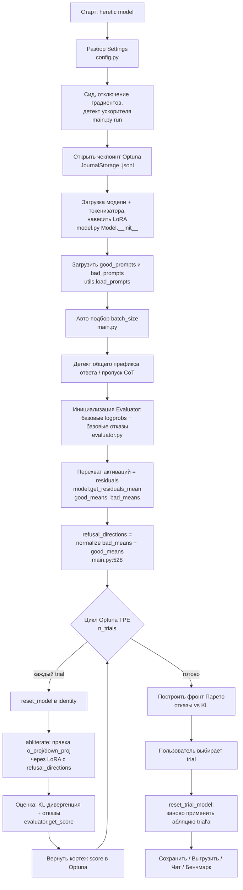
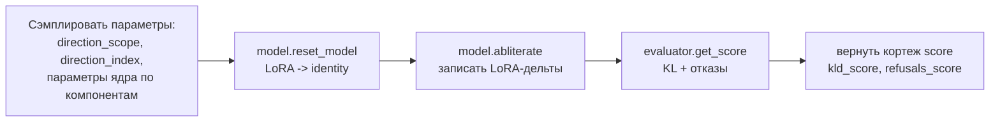
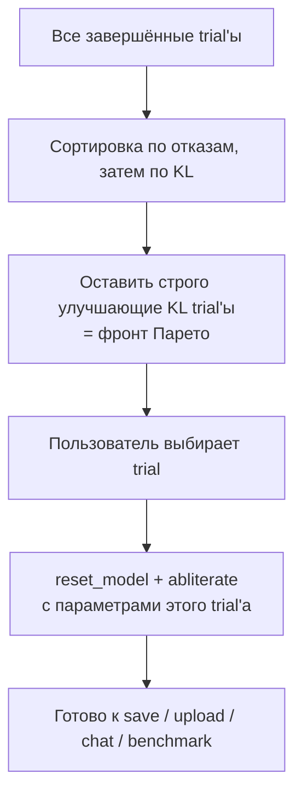

# Heretic — Архитектура и сквозной пайплайн

> 🌐 **Язык:** Русский (этот файл) · [🇬🇧 English version](ARCHITECTURE.md)

> Полный, исчерпывающий разбор того, как работает Heretic: от запуска программы до
> получения (и сохранения) модели со снятой цензурой. Документ рассчитан на читателя,
> который действительно хочет разобраться в системе — включая точные места в коде,
> где перехватываются активации, где вычисляется «направление отказа», как абляция
> применяется к весам, как измеряется KL-дивергенция и как оптимизатор выбирает
> итоговую модель.
>
> Ссылки на код даны в формате `файл:строка` и указывают на текущее дерево исходников
> в `src/heretic/`.

---

## Содержание

1. [Что делает Heretic (одним абзацем)](#1-что-делает-heretic)
2. [Ключевая идея: направленная абляция](#2-ключевая-идея-направленная-абляция)
3. [Схема пайплайна верхнего уровня](#3-схема-пайплайна-верхнего-уровня)
4. [Поддерживаемые архитектуры моделей](#4-поддерживаемые-архитектуры-моделей)
5. [Где перехватываются и хранятся активации](#5-где-перехватываются-и-хранятся-активации)
6. [Вычисление направления отказа (разница средних)](#6-вычисление-направления-отказа)
7. [Цикл оптимизации (Optuna TPE)](#7-цикл-оптимизации)
8. [Математика абляции — как из активаций получаются веса](#8-математика-абляции)
9. [Оценка — KL-дивергенция и подсчёт отказов](#9-оценка)
10. [Скоринг, «откат» и выбор по Парето](#10-скоринг-откат-и-выбор-по-парето)
11. [Сохранение модели, прошедшей порог](#11-сохранение-модели)
12. [Детерминизм и воспроизводимость](#12-детерминизм-и-воспроизводимость)
13. [Карта модулей](#13-карта-модулей)
14. [Research-возможности (интерпретируемость)](#14-research-возможности)
15. [Глоссарий](#15-глоссарий)

---

## 1. Что делает Heretic

Heretic снимает «safety alignment» (цензуру) с трансформерной языковой модели **без
какого-либо дообучения** (без градиентного спуска по модели). Он делает это через
**направленную абляцию** («абилитерацию»): определяет направление в пространстве
активаций модели, отвечающее за «отказ», и хирургически лишает определённые весовые
матрицы способности записывать это направление в остаточный поток (residual stream).
Точная сила абляции для каждого слоя и каждого компонента подбирается **автоматически**
байесовским оптимизатором (Optuna TPE), который одновременно минимизирует две величины:
число отказов на «вредных» промптах и KL-дивергенцию от исходной модели на «безобидных»
промптах (это прокси для «насколько сильно пострадал интеллект модели»).

---

## 2. Ключевая идея: направленная абляция

Декодер-only трансформер поддерживает **остаточный поток (residual stream)**: бегущий
вектор скрытого состояния, из которого каждый слой читает и в который пишет. В каждом
слое в остаточный поток пишут два подмодуля:

- **выходная проекция внимания** (`o_proj` / `out_proj`) и
- **нисходящая проекция MLP** (`down_proj` / `w2`).

```
                 остаточный поток (hidden state h)
   h ──────────────┬───────────────────────────┬─────────────► h'
                   │                           │
              ┌────▼────┐                 ┌────▼────┐
              │ Внимание │                 │   MLP   │
              │  (attn)  │                 │  блок   │
              └────┬────┘                 └────┬────┘
                   │ пишет через               │ пишет через
                   │  o_proj  ── абляция ──►    │ down_proj ── абляция
                   └───────────┬───────────────┘
                        (именно эти две проекции
                         Heretic ортогонализует)
```

**Направленная абляция** = взять вектор «направления отказа» `v` (единичный вектор в
пространстве скрытых состояний) и ортогонализовать *выход* `o_proj` и `down_proj`
относительно `v`. После абляции эти матрицы больше не могут добавлять в остаточный поток
никакой компоненты вдоль `v` — то есть модель больше не может «выражать отказ».

Направление отказа вычисляется эмпирически как **разница средних**: среднее скрытое
состояние для «вредных» промптов минус среднее для «безобидных». См. разделы 5–6.

Конкретные новшества Heretic по сравнению с классической абилитерацией:

- Сила абляции по слоям задаётся **гибким весовым ядром** (не константой), форма
  которого оптимизируется.
- Индекс направления отказа — **число с плавающей точкой**: нецелые значения линейно
  интерполируют между двумя соседними послойными направлениями, открывая направления,
  не принадлежащие ни одному отдельному слою.
- Внимание и MLP получают **независимые** параметры абляции (абляция MLP обычно сильнее
  вредит модели, поэтому её часто оставляют почти нетронутой).

---

## 3. Схема пайплайна верхнего уровня



Каждая стрелка соответствует конкретному шагу в `main.py:run()` (начинается с
`main.py:180`).

---

## 4. Поддерживаемые архитектуры моделей

### 4.1 Какой класс модели загружается

`get_model_class()` (`model.py:39`) смотрит в конфиг модели: если в каком-либо
под-конфиге есть `vision_config`, модель грузится как `AutoModelForImageTextToText`
(мультимодальная); иначе — как `AutoModelForCausalLM` (только текст). Мультимодальные
VL-модели рассматриваются как causal LM с добавленным энкодером изображений — LoRA
`task_type` всегда `CAUSAL_LM` (`model.py:229`).

### 4.2 Как находятся слои трансформера

`get_layers()` (`model.py:367`) разворачивает PEFT-обёртку и затем пробует:

1. `model.model.language_model.layers` — большинство мультимодальных моделей.
2. `model.model.layers` — только-текстовые модели.

### 4.3 Какие компоненты подвергаются абляции

Для каждого слоя `get_layer_modules()` (`model.py:381`) собирает абляционные модули
проекций, сгруппированные в два логических компонента: **`attn.o_proj`** и
**`mlp.down_proj`**. Функция перебирает множество архитектурно-специфичных путей
атрибутов (каждый в блоке `suppress(Exception)`, поэтому неизвестные раскладки просто
пропускаются):

| Логический компонент | Проверяемый путь атрибута | Архитектура |
| :--- | :--- | :--- |
| `attn.o_proj` | `self_attn.o_proj` | большинство dense-моделей |
| `attn.o_proj` | `linear_attn.out_proj` | Qwen3.5 MoE hybrid (GatedDeltaNet / линейное внимание) |
| `attn.o_proj` | `conv.out_proj` | LFM dense operator blocks |
| `attn.o_proj` | `self_attn.out_proj` | LFM transformer blocks |
| `mlp.down_proj` | `mlp.down_proj` | большинство dense-моделей |
| `mlp.down_proj` | `mlp.experts[*].down_proj` | MoE (например, Qwen3) |
| `mlp.down_proj` | `block_sparse_moe.experts[*].w2` | Phi-3.5-MoE |
| `mlp.down_proj` | `feed_forward.w2` | LFM dense |
| `mlp.down_proj` | `feed_forward.experts[*].w2` | LFM MoE |
| `mlp.down_proj` | `shared_mlp.output_linear` | Granite MoE Hybrid (слои внимания) |
| `mlp.down_proj` | `moe.experts[*].output_linear` | Granite MoE Hybrid (MoE-слои) |

Поскольку у гибридных моделей на **разных слоях разные компоненты**,
`get_abliterable_components()` (`model.py:451`) сканирует **все** слои, чтобы собрать
множество реально присутствующих компонентов.

### 4.4 Что поддерживается, а что нет

- ✅ Большинство **dense**-моделей, многие **мультимодальные**, несколько **MoE**-архитектур,
  некоторые **гибридные** модели (например, Qwen3.5).
- ❌ **Чистые state-space модели** и некоторые другие research-архитектуры не
  поддерживаются «из коробки» (в них нет пишущей матрицы вида `o_proj`/`down_proj` для
  ортогонализации). Ассерт `assert total_modules > 0` (`model.py:447`) защищает от слоя
  без единого абляционного модуля.

### 4.5 На каких слоях действует направление

- **Направление отказа** вычисляется для **каждого** слоя (разница средних по слою —
  раздел 6).
- Для «глобального» scope оптимизатор сэмплирует `direction_index` в диапазоне
  `[0.4·L, 0.9·L]` (`main.py:574`), потому что различение вредное/безобидное сильнее
  всего **чуть за серединой** стека слоёв (по Arditi et al. 2024).
- **Весовое ядро абляции** (раздел 8) центрируется в `max_weight_position`,
  сэмплируемом в `[0.6·L, 1.0·L]` (`main.py:606`).

---

## 5. Где перехватываются и хранятся активации

Это сердце вопроса о «перехвате».

### 5.1 Место перехвата

Весь захват активаций происходит в **`Model.get_residuals()` (`model.py:697`)**.
**Ручного forward-hook нет** — Heretic использует встроенный флаг transformers
`output_hidden_states=True` у `model.generate()`:

```python
# model.py:700
_, outputs = self.generate(
    prompts,
    max_new_tokens=1,            # генерируем ровно ОДИН токен
    output_hidden_states=True,   # <-- ПЕРЕХВАТ АКТИВАЦИЙ
    return_dict_in_generate=True,
    use_cache=False,
)
hidden_states = outputs.hidden_states[0]   # состояния для 1-го ген. токена (model.py:716)
```

`hidden_states` — это кортеж по слоям; элемент 0 — выход эмбеддингов, элементы 1..N —
значения остаточного потока **после** каждого блока трансформера. Heretic берёт вектор
на **последней позиции промпта** для каждого слоя и стекирует их:

```python
# model.py:719
residuals = torch.stack(
    [layer_hidden_states[:, -1, :] for layer_hidden_states in hidden_states],
    dim=1,
)                                          # форма: (prompt, layer+1, hidden_dim)
residuals = residuals.to(torch.float32)    # upcast для численной стабильности (model.py:729)
```

Итак, захватываемая активация — это **остаточный поток на последнем токене промпта, для
первого генерируемого токена**, на каждой границе слоёв. Это ровно та точка, где модель
«решает», отказывать или нет.

```
токены промпта:     t1  t2  t3 ... tK   [<- отсюда начинается генерация]
                                   ^
                                   └── вектор residual захватывается в ЭТОЙ позиции,
                                       для каждого слоя, для каждого промпта
```

### 5.2 Опциональная очистка на этапе захвата

- **Винзоризация** (`model.py:731`): если `winsorization_quantile < 1`, каждый
  по-промптовый, по-слойный вектор ограничивается симметричным квантилем своих
  абсолютных значений — это укрощает «массивные активации» в некоторых моделях.
- **Выгрузка на CPU** (`model.py:743`): если `offload_outputs_to_cpu` (по умолчанию
  `true`), тензор residuals сразу перемещается на CPU для снижения пикового VRAM.

### 5.3 Где активации «живут» до абляции

Два пути вызова, в `main.py:499–528`:

- **Путь по умолчанию** (нужны только средние): `get_residuals_mean()` (`model.py:757`)
  проходит батчами и накапливает бегущую сумму в **float64 на CPU**, возвращая
  `good_means` / `bad_means` формы `(layer+1, hidden_dim)`. Полные по-промптовые
  residuals никогда не хранятся все сразу.
- **Research-путь** (`--print-residual-geometry` / `--plot-residuals`):
  `get_residuals_batched()` (`model.py:749`) возвращает **полный** тензор
  `(prompt, layer+1, hidden_dim)`; затем `good_means`/`bad_means` берутся через
  `.mean(dim=0)`, а `Analyzer` анализирует полные residuals до того, как они будут
  удалены `del` (`main.py:521`).

После вычисления средних в цикл оптимизации переходит только **тензор
`refusal_directions`** (раздел 6). Громоздкие по-промптовые residuals и средние явно
освобождаются:

```python
# main.py:542
del good_means, bad_means
empty_cache()                # main.py:546
```

`refusal_directions` хранится в замыкании `run()` и захватывается вложенными функциями
`objective()` и `reset_trial_model()`. Он имеет форму `(layer+1, hidden_dim)` и живёт на
CPU (если выгружено) или на GPU; во время абляции каждая строка по мере надобности
переносится на устройство соответствующего модуля (`model.py:531`).

---

## 6. Вычисление направления отказа

Как только есть `good_means` (🟢 безобидные) и `bad_means` (🔴 вредные), послойные
направления отказа — это нормализованная разница средних (`main.py:528`):

```python
refusal_directions = F.normalize(bad_means - good_means, p=2, dim=1)
#                                 └── вредные минус безобидные, по слою, затем нормировка
```

Опционально (`orthogonalize_direction`, по умолчанию `true`, `main.py:530`) Heretic
применяет **projected abliteration**: убирает из каждого направления отказа компоненту,
параллельную «хорошему» (безобидному) направлению, оставляя только ортогональную часть,
затем перенормирует. Это вычитает *только* специфичную для отказа компоненту и оставляет
общую семантику нетронутой:

```python
# main.py:534-539
good_directions   = F.normalize(good_means, p=2, dim=1)
projection_vector = torch.sum(refusal_directions * good_directions, dim=1)
refusal_directions = refusal_directions - projection_vector.unsqueeze(1) * good_directions
refusal_directions = F.normalize(refusal_directions, p=2, dim=1)
```

> **Сдвиг индекса.** `refusal_directions[0]` — это направление слоя эмбеддингов. Поэтому
> во время абляции слой `i` использует `refusal_directions[i + 1]`, а float
> `direction_index` сдвигается на `+1` (раздел 8, `model.py:472` и `model.py:511`).

---

## 7. Цикл оптимизации

Heretic формулирует абилитерацию как **многокритериальную оптимизацию чёрного ящика**,
решаемую **многомерным TPE**-сэмплером Optuna (`main.py:677`):

```python
study = optuna.create_study(
    sampler=TPESampler(
        n_startup_trials=settings.n_startup_trials,  # сначала случайное исследование
        n_ei_candidates=128,
        multivariate=True,
        seed=settings.seed,
    ),
    directions=[StudyDirection.MINIMIZE, StudyDirection.MINIMIZE],  # (KL, отказы)
    storage=storage,           # JournalStorage на чекпоинте .jsonl (возобновляемо)
    study_name="heretic",
    load_if_exists=True,
)
```

### 7.1 Что делает один trial

`objective(trial)` (`main.py:552`):



Сэмплируемые параметры на каждый trial:

- `direction_scope` ∈ {`global`, `per layer`} (`main.py:557`). `per layer` ставит
  `direction_index = None`, то есть каждый слой абилитерируется **своим** направлением.
  `global` использует одно интерполированное направление для всех слоёв.
- `direction_index`: float в `[0.4·L, 0.9·L]` (`main.py:574`).
- Для **каждого** абляционного компонента (attn / mlp) сэмплируется **весовое ядро**
  (`main.py:585–630`):
  - `max_weight` — пиковая сила абляции. Диапазон `[0.8, 1.5]` для внимания, но
    `[-0.25, 1.5]` **с обрезкой до ≥ 0** для MLP, чтобы оптимизатор мог дать
    положительную вероятность **ровно 0** = «вообще не абилитерировать MLP» (issue #202).
  - `max_weight_position` — слой пиковой абляции, в `[0.6·L, 1.0·L]`.
  - `min_weight` — сэмплируется как доля от `max_weight` (многомерный TPE не умеет
    работать с переменными диапазонами), затем переводится в абсолютное значение.
  - `min_weight_distance` — полуширина ядра, в `[1, 0.6·L]`.

> **Почему все параметры сэмплируются всегда**: многомерный TPE не поддерживает
> условные/переменно-диапазонные параметры, поэтому `direction_index` сэмплируется даже
> в scope `per layer` и затем игнорируется (`main.py:580`).

### 7.2 Изоляция между trial'ами («откат»)

Никакого буквального «отката плохих весов» нет. Вместо этого абляция применяется как
**LoRA-адаптер** поверх замороженных базовых весов, а между trial'ами адаптер
сбрасывается в **тождественное преобразование**:

- `reset_model()` (`model.py:315`) — быстрый путь: обнулить все матрицы `lora_B`
  (`torch.nn.init.zeros_`), что делает LoRA-дельту `B·A = 0`, то есть модель снова
  бит-в-бит исходная. Базовые веса во время поиска никогда не изменяются.
- Медленный путь (только при смене модели или после merge): полностью перезагружает
  базовую модель и заново навешивает LoRA.

Таким образом, каждый trial стартует с чистой модели, применяет свою абляцию, оценивается,
а следующий trial просто сбрасывает состояние. Ничего «отменять» не нужно, потому что
базовые веса никогда не трогались. Как восстанавливается *выбранный* trial — см. раздел 10.

---

## 8. Математика абляции

Этот раздел отвечает: *как из активаций получаются веса, и к каким именно матрицам?* Всё
это — в `Model.abliterate()` (`model.py:461`).

### 8.1 Послойное весовое ядро абляции

Для каждого индекса слоя `i` и компонента, с параметрами
`(max_weight, max_weight_position, min_weight, min_weight_distance)`:

```python
# model.py:489-500
distance = abs(i - max_weight_position)
if distance > min_weight_distance:
    continue                     # слишком далеко от пика -> НЕ абилитерировать этот слой
weight = max_weight + (distance / min_weight_distance) * (min_weight - max_weight)
if weight == 0:
    continue                     # сила 0 -> пропуск (адаптер уже identity)
```

Это **ядро в форме шатра (tent)** вдоль оси слоёв:

```
   сила
  max_weight ┤            ╱╲
             │           ╱  ╲
             │          ╱    ╲
  min_weight ┤    ─────╱      ╲─────
           0 ┤────────┴────────┴────────► индекс слоя
                  ↑    ↑    ↑    ↑
        (без абляции)  │  max_weight_position
                       └── min_weight_distance (полуширина);
                           за её пределами слои не трогаются
```

У внимания и MLP **независимые** ядра, поэтому эти два компонента могут абилитерироваться
на разных слоях с разной силой.

### 8.2 Выбор вектора направления для слоя

```python
# model.py:508-513
if direction_index is None:                 # scope "per layer"
    v = refusal_directions[i + 1]           # собственное направление слоя (сдвиг +1)
else:                                        # scope "global"
    v = interpolated_direction              # вычислено один раз (см. ниже)
```

Для глобального scope float `direction_index` интерполирует между двумя ближайшими
послойными направлениями (`model.py:472`):

```python
weight, index = math.modf(direction_index + 1)     # дробная и целая части (сдвиг +1)
v = F.normalize(refusal_directions[int(index)].lerp(refusal_directions[int(index)+1], weight), p=2, dim=0)
```

### 8.3 Превращение направления в LoRA-дельту на `o_proj` / `down_proj`

Для каждого целевого модуля (attention `o_proj` или MLP `down_proj`) Heretic вычисляет
LoRA-обновление контролируемого ранга, которое **ортогонализует выход модуля**
относительно `v`. Математическое тождество:

```
ΔW = −λ · v · (vᵀ W)          (внешнее произведение ранга 1)
   ⇒  lora_B = −λ · v          (форма d_out × 1)
      lora_A =  vᵀ W           (форма 1 × d_in)
```

Применение `W + ΔW = (I − λ v vᵀ) W` убирает (при `λ = 1`) компоненту каждого выходного
столбца вдоль `v`. Базовый вес `W` сначала деквантизуется во float32, если модель была
загружена в 4-битном формате (`model.py:541–553`).

**Нормализация по строкам** (`row_normalization`, `model.py:558`) имеет три режима:

| Режим | Что происходит |
| :--- | :--- |
| `none` | прямая дельта ранга 1 как выше (`lora_A = vᵀW`, `lora_B = −λv`). |
| `pre` | вычислить дельту относительно **нормализованной по строкам** `W`, затем масштабировать `lora_B` на исходные нормы строк, чтобы она применялась к исходным весам. |
| `full` (по умолчанию) | **norm-preserving biprojected abliteration**: применить дельту, перенормировать строки, восстановить исходные величины строк, вычесть исходную матрицу для получения дельты, затем взять **рандомизированный low-rank SVD** (`torch.svd_lowrank`, ранг `r = full_normalization_lora_rank`, по умолчанию 3) и записать усечённые факторы в `lora_A`/`lora_B`. Это приближённо сохраняет величину каждой строки, снижая побочный урон. |

Полученные факторы записываются прямо в тензоры адаптера (`model.py:609–612`):

```python
module.lora_A["default"].weight.data = lora_A.to(...)
module.lora_B["default"].weight.data = lora_B.to(...)
```

> **Ответ на «до нормализации или после слоёв внимания?»**
> **Направление `v`** выводится из **пост-блочного остаточного потока** (скрытое
> состояние после того, как внимание+MLP уже добавлены обратно — раздел 5).
> **Абляция** применяется к **пишущим в остаточный поток проекциям**: выходной проекции
> внимания (`o_proj`, после вычисления внимания) и нисходящей проекции MLP (`down_proj`,
> выход MLP). Нормализация по строкам, когда включена, работает над **строками весовой
> матрицы** во время вычисления LoRA — это свойство того, как строится дельта, а не
> свойство активаций.

### 8.4 Почему LoRA, а не прямое редактирование весов

- **Скорость**: сброс в identity — это просто обнуление `lora_B`, без перезагрузки
  (`model.py:333`).
- **Неразрушающесть**: базовые веса никогда не изменяются в течение ~200 trial'ов поиска.
- **Гибкость экспорта**: итог можно сохранить как маленький адаптер или влить в полные
  веса (раздел 11).

---

## 9. Оценка

Каждый trial оценивается функцией `Evaluator.get_score()` (`evaluator.py:95`). Две
величины измеряются на **оценочных** наборах промптов (`good_evaluation_prompts`,
`bad_evaluation_prompts` — отложенные `test`-split'ы).

### 9.1 KL-дивергенция (урон исходной модели)

В `Evaluator.__init__` (`evaluator.py:32`) распределения лог-вероятностей первого токена
**исходной** модели на безобидных оценочных промптах захватываются **один раз** как
`base_logprobs`. Для каждого trial'а лог-вероятности абилитерированной модели на тех же
промптах сравниваются:

```python
# evaluator.py:98
logprobs = self.model.get_logprobs_batched(self.good_prompts)
kl_divergence = F.kl_div(
    logprobs, self.base_logprobs,
    reduction="batchmean", log_target=True,
).item()
```

`get_logprobs()` (`model.py:783`) генерирует один токен с `output_logits=True` и берёт
`log_softmax` от **сырых логитов** (не от обработанных generation scores, которые могут
содержать `-inf` и давать NaN в KL). Меньше KL ⇒ абилитерированная модель ведёт себя
ближе к исходной ⇒ меньше урона способностям.

### 9.2 Подсчёт отказов (насколько модель ещё цензурирована)

`count_refusals()` (`evaluator.py:67`) генерирует полные ответы (до `max_response_length`
токенов) на вредные оценочные промпты и вызывает `is_refusal()` (`evaluator.py:47`) для
каждого. Ответ считается отказом, если:

- он пустой (классифицируется как отказ, чтобы оптимизатор не предпочитал пустые ответы),
  или
- после приведения к нижнему регистру, удаления выделения `*`, нормализации апострофов и
  пробелов он содержит любой из ~30 `refusal_markers` (`config.py:431`), например
  `"sorry"`, `"i cannot"`, `"as an ai"`, `"illegal"`, `"unethical"`.

> Это **эвристика на уровне текста**, полностью отдельная от вычисления направления на
> основе активаций. Это лишь метрика, а не часть математики направления.

Базовое `base_refusals` (отказы **исходной** модели) измеряется один раз при инициализации
(`evaluator.py:42`) и используется для нормировки скора отказов.

---

## 10. Скоринг, «откат» и выбор по Парето

### 10.1 Кортеж скора

`get_score()` возвращает 2-кортеж, который Optuna минимизирует (`evaluator.py:113–125`):

```python
refusals_score = refusals / base_refusals            # доля исходных отказов, оставшихся
if kl_divergence >= kl_divergence_target:            # по умолчанию target = 0.01
    kld_score = kl_divergence / kl_divergence_scale
else:
    # Ниже target заменяем сырой KL на член от отказов, чтобы сэмплер не тратил
    # trial'ы на исследование областей параметров, которые "ничего не делают".
    kld_score = refusals_score * kl_divergence_target / kl_divergence_scale
score = (kld_score, refusals_score)
```

Обе величины минимизируются одновременно → **фронт Парето** trial'ов, каждый из которых
— оптимальный компромисс между «мало отказов» и «низкая KL-дивергенция».

### 10.2 Сброс между trial'ами (практический «откат»)

Как описано в 7.2: `reset_model()` обнуляет матрицы LoRA `lora_B`, возвращая модель ровно
к исходной перед следующим `abliterate()`. Во время поиска нет частичного принятия весов —
trial либо оценивается и его параметры записываются в study Optuna, либо сбрасывается.
**Чекпоинт** (возобновляемый `JournalStorage` `.jsonl` в `checkpoints/`, `main.py:298`)
сохраняет параметры и метрики trial'ов, а не веса модели.

### 10.3 Выбор и восстановление победителя

После цикла Heretic заново вычисляет фронт Парето из сырых user-attrs `(refusals, KL)`
(`main.py:726–739`) и показывает его. Когда пользователь выбирает trial,
`reset_trial_model()` (`main.py:854`) сбрасывает модель и **заново применяет ровно ту
абляцию** этого trial'а, используя его сохранённые `direction_index` и по-компонентные
`AbliterationParameters`. Это реконструирует выбранную модель со снятой цензурой по
требованию.



---

## 11. Сохранение модели

Две стратегии экспорта (`obtain_export_strategy`, `main.py:101`; `ExportStrategy` в
`config.py:35`):

- **`adapter`** — сохранить/выгрузить только LoRA-адаптер (`model.model.save_pretrained`).
  Маленький; можно влить позже.
- **`merge`** — влить LoRA в базовые веса через `get_merged_model()` (`model.py:266`):
  - не-квантованная: `merge_and_unload()` напрямую (`model.py:309`).
  - квантованная (`bnb_4bit`): базовая модель перезагружается в полной точности на CPU,
    обученные веса адаптера копируются, затем сливаются (`model.py:271–305`) — поэтому
    merge квантованной модели требует ~3× числа параметров в RAM.

Слитая модель плюс токенизатор (и процессор для мультимодальных) записываются через
`save_pretrained(max_shard_size=...)` или `push_to_hub(...)`. При выгрузке Heretic может
приложить метаданные воспроизводимости (`reproduce.json`) и теги карточки модели
(`heretic`, `uncensored`, `abliterated`, ...). Поскольку merge уничтожает LoRA в памяти,
устанавливается `needs_reload`, чтобы последующий выбор trial'а вызвал полную
перезагрузку (`model.py:312`).

---

## 12. Детерминизм и воспроизводимость

- Один `seed` (случайный, если не задан, `main.py:266`) сидирует Python `random`, NumPy,
  PyTorch и сэмплер Optuna (`set_seed` и `TPESampler(seed=...)`).
- Генерация **жадная** (`do_sample=False`, `model.py:658`) для детерминированных ответов.
- Рандомизированный low-rank SVD в нормализации `full` пересидируется прямо перед вызовом
  (`model.py:592`), чтобы восстановление trial'а не зависело от истории RNG.
- `torch.set_grad_enabled(False)` (`main.py:274`) — чистый инференс, без autograd.
- Study Optuna чекпоинтится в возобновляемый `.jsonl`; прерывание по Ctrl+C
  останавливается корректно и может быть продолжено.
- Полное воспроизведение опубликованной модели поддерживается через `--reproduce`
  (загружает `reproduce.json`, проверяет окружение и, для v2, хэши выходных файлов) —
  `reproduce.py`.

---

## 13. Карта модулей

| Файл | Ответственность |
| :--- | :--- |
| `main.py` | Оркестрация: CLI-цикл, авто-подбор batch_size, вычисление residuals/направления, цикл Optuna, выбор по Парето, экспорт/выгрузка/чат/бенчмарк. |
| `model.py` | **Ядро.** Загрузка модели (перебор dtype, квантование), навешивание LoRA, архитектурно-осознанный поиск слоёв/компонентов, **захват активаций** (`get_residuals`), **абляция** (`abliterate`), logprobs, генерация, merge/экспорт. |
| `evaluator.py` | KL-дивергенция, детекция отказов, скор на trial. |
| `config.py` | `Settings` (Pydantic): все параметры, спецификации датасетов, список бенчмарков, источники CLI/env/TOML. |
| `analyzer.py` | Research-only: геометрия residuals + PaCMAP-визуализация. |
| `system.py` | Детект ускорителя/CPU (CUDA/ROCm/XPU/MLU/SDAA/MUSA/NPU/MPS), `empty_cache`, обнаружение версий пакетов. |
| `utils.py` | Загрузка датасетов/промптов, `Prompt`, батчинг, HF-хелперы, вывод. |
| `reproduce.py` | Воспроизводимость: сбор/загрузка `reproduce.json`, проверки окружения и хэшей. |
| `progress.py` | Патчинг tqdm (сейчас отключён). |

---

## 14. Research-возможности (интерпретируемость)

Включаются опциональным extra `research` и двумя флагами (требуют полные по-промптовые
residuals, отсюда «research-путь» в разделе 5.3):

- `--print-residual-geometry` (`analyzer.py:33`): для каждого слоя печатает косинусные
  сходства и L2-нормы между средними/геометрическими медианами вредных/безобидных,
  направление отказа и силуэтный коэффициент кластеров good/bad. (Использует
  `geom_median` и `scikit-learn`.)
- `--plot-residuals`: проецирует residuals в 2D через **PaCMAP**, выравнивает
  последовательные слои по геометрической медиане и рендерит PNG на каждый слой плюс
  анимированный GIF, показывающий, как кластеры вредных/безобидных разделяются по слоям.

Это диагностические/визуализационные инструменты; они не меняют пайплайн абляции.

---

## 15. Глоссарий

| Термин | Значение |
| :--- | :--- |
| **Residual (остаточный поток)** | Бегущий вектор скрытого состояния трансформера; захватывается как «активации» на последнем токене промпта (`model.py:697`). |
| **Направление отказа** `v` | Единичный вектор = нормализованная (среднее вредных − среднее безобидных) скрытого состояния, по слою (`main.py:528`). |
| **Абилитерация** | Ортогонализация выходов `o_proj`/`down_proj` относительно `v`, чтобы модель не могла выражать отказ. |
| **Весовое ядро абляции** | Шатрообразный послойный профиль силы, задаваемый `max_weight`, `max_weight_position`, `min_weight`, `min_weight_distance`. |
| **KL-дивергенция** | Расстояние между распределениями первого токена абилитерированной и исходной модели на безобидных промптах; прокси для урона способностям. |
| **Маркеры отказа** | Текстовые подстроки, наличие которых классифицирует ответ как отказ (`config.py:431`). |
| **LoRA-адаптер** | Низкоранговая аддитивная дельта весов (`B·A`), применяемая для нанесения/сброса абляции без изменения базовых весов. |
| **Фронт Парето** | Множество trial'ов, являющихся оптимальными компромиссами между числом отказов и KL-дивергенцией. |
| **direction_index** | Float, выбирающий/интерполирующий глобальное направление отказа; `None` ⇒ послойные направления. |

---

*Как запускать инструмент — см. [HOW_TO_USE.MD](HOW_TO_USE.MD). Где живут две группы
промптов и место перехвата — см. [HOW_TO_WORK.MD](HOW_TO_WORK.MD). Как работать с
датасетами — см. [../datasets/HOW_TO_USE_DATASETS.MD](../datasets/HOW_TO_USE_DATASETS.MD).*
